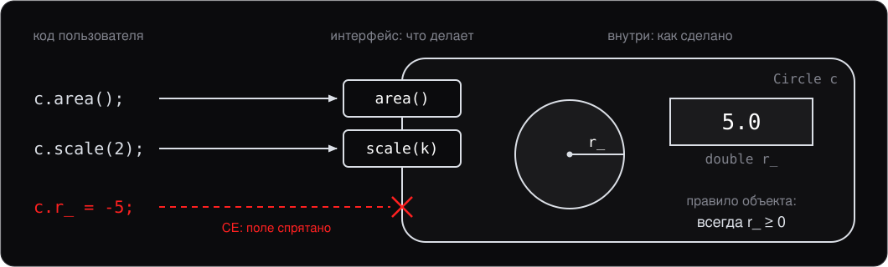
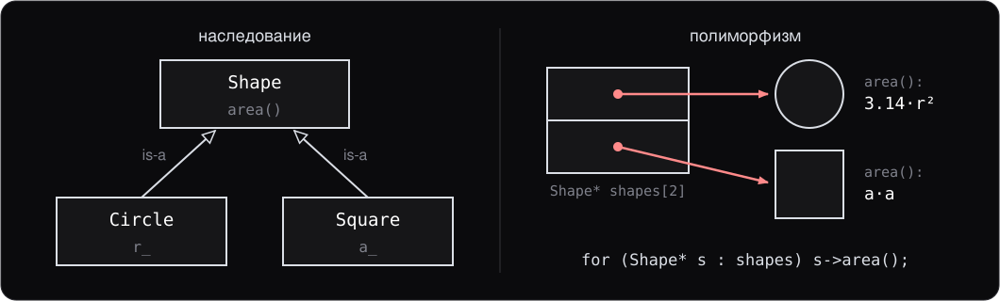

<style>
section {
    font-size: 25px;
}
</style>

<!-- _class: lead -->

# Лекция 4.

## Введение в ООП

---

# План

1. ООП — основные термины
2. Структуры и классы
3. Поля, методы, `this`
4. Спецификаторы доступа
5. Конструкторы
6. Деструкторы
7. `const`-методы и `static`
8. Агрегатная инициализация и designated initializers

---
<!-- header: 1. Основные термины -->

# 1. ООП — основные термины

Объектно-ориентированное программирование строится вокруг четырёх идей:

1. **Абстракция** — отделить «что» от «как»
2. **Инкапсуляция** — спрятать внутренности за интерфейсом
3. **Наследование** — переиспользовать поведение
4. **Полиморфизм** — одинаковый интерфейс — разное поведение

C++ поддерживает все четыре, но **не навязывает** их: классы можно писать и без наследования, и без полиморфизма.

---

## Абстракция и инкапсуляция



- **Абстракция:** снаружи видно, **что** объект делает, а не **как**.
- **Инкапсуляция:** до устройства не добраться в обход интерфейса — поэтому объект сам держит своё правило, а реализацию можно менять.

---

## Наследование и полиморфизм



- **Наследование:** `Circle` и `Square` получают всё, что есть у `Shape`, — отношение «is-a». Лекция 6.
- **Полиморфизм:** один вызов `s->area()` — разная формула по **реальному** типу. Виртуальные функции (virtual functions), лекция 7.

Оба механизма **дорогие** — их применяют избирательно.

---
<!-- header: 2. Структуры и классы -->

# 2. Структуры и классы

В C `struct` — это просто набор полей:

```c
struct Point {
    int x;
    int y;
};

struct Point p = {3, 4};
printf("%d %d\n", p.x, p.y);
```

Только данные, никаких методов. Это до сих пор работает в C++.

---

## `class` и `struct` в C++

В C++ `struct` и `class` — **почти одно и то же**:

```cpp
class Point1 {
    int x, y;       // по умолчанию private
};

struct Point2 {
    int x, y;       // по умолчанию public
};
```

**Единственное отличие** — спецификатор доступа (access specifier) по умолчанию:

- `class` — `private`
- `struct` — `public`

---

## Соглашение

Принятый стиль:

- **`struct`** — для «простых наборов данных», у которых все поля публичные и нет инвариантов. Часто без конструкторов.
- **`class`** — для всего остального: классов с инкапсуляцией, инвариантами, методами.

Это не правило языка, а соглашение, помогающее читателю кода быстро понять намерение.

---
<!-- header: 3. Поля и методы -->

# 3. Поля, методы, `this`

```cpp
class Point {
public:
    void print() const {
        std::print("({}, {})\n", x_, y_);
    }

    int x_ = 0;     // поле с инициализатором по умолчанию
    int y_ = 0;
};

Point p;
p.x_ = 3;
p.print();          // (3, 0)
```

- Поля можно инициализировать «по умолчанию» прямо в объявлении (C++11)
- Методы определяются внутри класса (тогда автоматически `inline`) или вне

---

## Определение метода вне класса

```cpp
class Point {
public:
    void print() const;
    int x_ = 0, y_ = 0;
};

void Point::print() const {     // имя класса :: имя метода
    std::print("({}, {})\n", x_, y_);
}
```

- В заголовочном файле — объявление, в `.cpp` — определение
- Уменьшает время компиляции и не «утаскивает» зависимости в каждый `#include`

---

## Указатель `this`

В каждом методе доступен скрытый указатель `this` — на объект, для которого метод вызван:


- `this` — это указатель типа `Point*` (или `const Point*` в `const`-методах)
- В современном коде явный `this->` пишут только когда нужно (например, чтобы отличить поле от параметра)

---

## Область видимости класса (class scope)

Внутри методов класса видны **все** его поля и методы — даже `private`:

```cpp
class Counter {
public:
    void inc() { ++count_; }       // ok: count_ private, но мы внутри класса
    int get() const { return count_; }
private:
    int count_ = 0;
};

Counter c;
c.inc();
std::print("{}\n", c.get());       // 1
// c.count_;                       // CE: private
```

Это и есть **инкапсуляция**: интерфейс публичен, состояние скрыто.

---
<!-- header: 4. Спецификаторы доступа -->

# 4. Спецификаторы доступа


**Практическое правило:** делайте **поля `private`** по умолчанию, методы — `public` только те, которые нужны вне класса. `protected` подробно разберём при наследовании (лекция 6).

---

## `friend`

`friend`-объявление даёт **другому классу или функции** доступ к `private` членам:

```cpp
class Account {
    int balance_ = 0;
    friend void audit(const Account& a);
};

void audit(const Account& a) {
    std::print("balance: {}\n", a.balance_);   // ok: friend
}
```

`friend` нужен редко: для перегрузки (overloading) операторов как свободных функций (лекция 5), для тестов, для тесно связанных классов. Не злоупотребляйте — `friend` ломает инкапсуляцию.

---
<!-- header: 5. Конструкторы -->

# 5. Конструкторы

**Конструктор** — специальный метод, который вызывается при **создании** объекта. Имя совпадает с именем класса:

```cpp
class Point {
public:
    Point(int x, int y) : x_(x), y_(y) {}    // конструктор
    int x_, y_;
};

Point p(3, 4);          // вызвался конструктор
Point p2{3, 4};         // brace-init, эквивалент
```

`Point(int, int)` — это и есть конструктор. Тело может быть пустым, если вся работа сделана до него, после двоеточия.

---

## Список инициализации членов

`: x_(x), y_(y)` — **список инициализации членов** (member initializer list). Поля инициализируются здесь, **до** входа в тело.

В теле — уже не инициализация, а **присваивание** полю, которое создано до входа в тело. Ссылку так не привязать:

```cpp
class Holder {
public:
    Holder(int& r) { r_ = r; }   // CE: constructor must explicitly
                                 // initialize the reference member 'r_'
private:
    int& r_;
};
```

Непривязанной ссылки не бывает, поэтому привязать её можно только в списке: `Holder(int& r) : r_(r) {}`.

---

## Конструктор по умолчанию

Конструктор без аргументов (default constructor):

```cpp
class Point {
public:
    Point() : x_(0), y_(0) {}
    int x_, y_;
};
```

Если не объявлено **ни одного** конструктора, компилятор сгенерирует его сам.
Если объявлен **хоть один** — уже не сгенерирует, и его просят явно:

```cpp
Point() = default;        // «сгенерируй сам»
```

---

## Делегирующий конструктор

Один конструктор может вызывать другой:

```cpp
class Point {
public:
    Point(int x, int y) : x_(x), y_(y) {}
    Point() : Point(0, 0) {}              // делегирует к Point(int, int)

    int x_, y_;
};

Point a;             // x_=0, y_=0
Point b(3, 4);       // x_=3, y_=4
```

Удобно, чтобы избежать дублирования логики инициализации.

---

## Копирующий конструктор

Копирующий конструктор (copy constructor) — копирование из другого объекта того же типа:

```cpp
class Buffer {
public:
    Buffer(const Buffer& other) : size_(other.size_), data_(new int[other.size_]) {
        std::copy(other.data_, other.data_ + size_, data_);
    }
    // ...
};

Buffer a(...);
Buffer b = a;        // вызывается копирующий конструктор
```

Если не определить — компилятор сгенерирует почленное копирование (memberwise copy). Чем это грозит — правило нуля, трёх и пяти (rule of zero, three, five), раздел 6.

---

## `explicit`

По умолчанию **конструктор с одним аргументом** работает как **неявное преобразование** (implicit conversion):

```cpp
class Wrapper {
public:
    Wrapper(int x) : x_(x) {}
};

void f(Wrapper w);
f(42);              // ok: int → Wrapper неявно
```

Иногда это удобно (например, `std::string` из `const char*`), но чаще — источник багов: типы случайно «склеиваются».

---

## `explicit` — запрет неявных преобразований

```cpp
class Wrapper {
public:
    explicit Wrapper(int x) : x_(x) {}
};

f(42);              // CE
f(Wrapper(42));     // ok, явное создание
```

**Правило:** конструкторы с одним аргументом помечайте `explicit`, кроме случаев, когда неявное преобразование действительно желательно.

С C++20 `explicit` может быть условным: `explicit(condition)` — пригодится в шаблонах.

---

## `= default` и `= delete`

`= default` — попросить компилятор сгенерировать стандартную версию. `= delete` — запретить определённую перегрузку.

```cpp
class Point {
public:
    Point() = default;                       // дефолтный
    Point(const Point&) = default;           // копирующий
};

class NonCopyable {
public:
    NonCopyable() = default;
    NonCopyable(const NonCopyable&) = delete;   // запрет копирования
};
```

Это **современный** способ управлять специальными функциями-членами (special member functions). Старый трюк через `private`-конструктор без определения больше не пишут.

---

## Если конструктор не смог

У конструктора **нет возвращаемого значения** — код ошибки вернуть некуда. Остаётся единственный способ:

```cpp
class Port {
public:
    explicit Port(int value) : value_(value) {
        if (value < 1 || value > 65535) {
            throw std::invalid_argument("port out of range");
        }
    }
private:
    int value_;
};
```

Это тот случай из лекции 3, где выбора между механизмами просто нет.

---

## Почему это не костыль

Конструктор обязан оставить объект в корректном состоянии. Альтернатива исключению — «полуживой» объект и флаг `is_valid()`, который все забывают проверять.


**Правило:** конструктор либо создаёт корректный объект, либо бросает. Третьего состояния быть не должно.

---
<!-- header: 6. Деструкторы -->

# 6. Деструкторы

**Деструктор** вызывается при **уничтожении** объекта. Имя — `~ClassName`:

```cpp
class Buffer {
public:
    Buffer(size_t n):
        data_(new int[n]) {}
    ~Buffer() {
        delete[] data_; // освобождаем ресурс
    }
private:
    int* data_;
};
```

В деструкторе принято освобождать ресурсы: память, файлы, мьютексы (mutex). Это и есть **RAII** в действии — мы её разбирали на лекции 2.

---

## Порядок конструкторов и деструкторов

```cpp
struct Inner {
    Inner() { std::print("Inner()\n"); }
    ~Inner() { std::print("~Inner()\n"); }
};

struct Outer {
    Outer() { std::print("Outer()\n"); }
    ~Outer() { std::print("~Outer()\n"); }
    Inner i_;
};

{ Outer o; }
// Inner()
// Outer()
// ~Outer()
// ~Inner()
```

Поле строится **до** тела конструктора, а разрушается **после** тела деструктора.

---

## Порядок целиком


Поля строятся в порядке объявления, разрушаются в обратном: что построено последним, разрушается первым. Порядок **детерминирован**. Базовый класс — на лекции 6.

---

## Правило нуля

```cpp
class Student {
public:
    void add_grade(int g) { grades_.push_back(g); }
private:
    std::string name_;
    std::vector<int> grades_;
};
```

Сгенерированный деструктор вызовет деструкторы полей, сгенерированное копирование скопирует каждое поле. `std::string` и `std::vector` сами умеют и то и другое — писать нечего.

**Правило нуля:** если поля сами управляют своими ресурсами, не пишите ни деструктор, ни копирование. Копия такого класса независима, уничтожение автоматическое, как у `int`, — это **семантика значений** (value semantics).

---

## Правило трёх и пяти

`Buffer` владеет массивом через сырой указатель (raw pointer), и деструктор ему нужен. А копирование компилятор сгенерирует прежнее, почленное:

```cpp
{
    Buffer a(10);
    Buffer b = a;   // скопирован указатель, а не массив
}                   // ~b: delete[]; ~a: delete[] ещё раз — UB
```

**Правило трёх:** деструктор, копирующий конструктор и `operator=` идут вместе — написали одно, напишите или запретите остальные:

```cpp
Buffer(const Buffer&) = delete;
Buffer& operator=(const Buffer&) = delete;
```

**Правило пяти** — то же для пяти: к трём добавляются move-операции, лекция 11.

---
<!-- header: 7. const и static -->

# 7. `const`-методы и `static`

```cpp
class Counter {
public:
    int get() const { return count_; }     // const-метод: не меняет объект
    void inc() { ++count_; }                // обычный метод
private:
    int count_ = 0;
};

const Counter c;
c.get();           // ok
c.inc();           // CE: cannot call non-const method on const object
```

Через `const`-метод компилятор гарантирует, что **поля объекта не меняются**.

Делайте `const` все методы, которые «только читают» состояние — это часть интерфейса.

---

## `mutable`

Иногда нужно изменить поле даже в `const`-методе — например, обновить кэш или счётчик обращений:

```cpp
class Cache {
public:
    int get(int key) const {
        ++stats_.queries;       // ok: поле stats_ объявлено mutable
        // ...
    }
private:
    mutable Stats stats_;       // можно менять в const-методах
};
```

`mutable` — для **«логически const»**-операций, которые меняют только не наблюдаемое снаружи состояние.

---

## Статические поля


```cpp
class Widget {
public:
    static int total_count;                // объявление
    inline static int alive_count = 0;     // с C++17 — сразу с определением
};

int Widget::total_count = 0;               // определение, в .cpp
```

---

## Статические методы

`static`-метод не имеет `this` — работает на уровне класса:

```cpp
class MathUtils {
public:
    static int square(int x) { return x * x; }
};

int r = MathUtils::square(5);    // 25
```

Применение: фабричные методы, утилиты, не зависящие от конкретного экземпляра.

---
<!-- header: 8. Агрегатная инициализация -->

# 8. Агрегатная инициализация и designated initializers

**Агрегат** (aggregate) — класс/структура без пользовательских конструкторов, базовых классов и `private` нестатических полей:

```cpp
struct Point {                // агрегат
    int x;
    int y;
};

Point p = {3, 4};             // агрегатная инициализация
Point p2{3, 4};               // brace-init форма (предпочтительна)
```

Поля заполняются **по порядку**.

---

## Designated initializers (C++20)

Можно указать имя поля явно:

```cpp
struct Config {
    std::string host = "localhost";
    int port = 8080;
    bool verbose = false;
};

Config c{ .host = "example.com", .verbose = true };
// port остаётся 8080
```

Преимущества: не нужно помнить порядок полей, можно опустить поля (получат defaults), код самодокументируется.

**Правило:** для агрегатов с >2 полями используйте designated init.

---

## Ограничения designated init

- Поля должны идти **в порядке объявления** в структуре:
  ```cpp
  Config c{ .port = 80, .host = "x" };   // CE: порядок неправильный
  ```
- Только для **агрегатов** — у класса с конструктором так не получится
- Нельзя в той же фигурной скобке смешивать designated и позиционные

Идиоматично: для «POD-структур настроек» — designated init. Для классов с инвариантами — обычный конструктор.

---
<!-- header: Итоги -->

# Итоги лекции

- **ООП термины:** абстракция, инкапсуляция, наследование, полиморфизм. C++ поддерживает все, не навязывает ни одного.
- **`class` vs `struct`** — только спецификатор доступа по умолчанию. Соглашение: `struct` для данных, `class` для всего остального.
- **Поля и методы.** `this` — указатель на объект. Область видимости класса — методы видят `private`.
- **Спецификаторы доступа:** `private` по умолчанию для полей. `friend` — редко.
- **Конструкторы:** список инициализации членов, делегирующие, `explicit` для single-arg, `= default` / `= delete`.
- **Деструкторы:** освобождение ресурсов в обратном порядке. Правило 0/3/5.
- **`const`-методы**, `mutable`, `static` поля и методы.
- **Designated initializers (C++20)** — для агрегатов это лучший способ инициализации.

---

# Дальше

Следующая лекция — **перегрузка операторов**:

- Какие операторы можно перегружать
- `operator=` и правило трёх
- Арифметика, сравнение, `<=>` (C++20)
- `()` — функтор (function object), `[]` — доступ по индексу
- Перегрузка потокового ввода/вывода
- `[[nodiscard]]`
